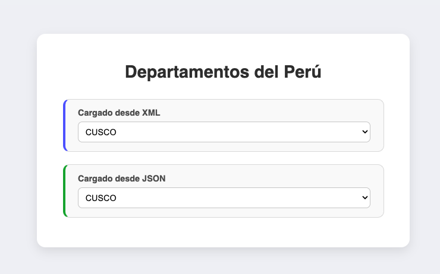

# 🇵🇪 Java Web App - Consulta de Departamentos del Perú
### Fecha 18-07-25
Aplicación web desarrollada en Java utilizando **Servlets** y **JSP**, que permite consultar departamentos del Perú a partir de archivos en formato **XML** y **JSON**.

Los datos son cargados dinámicamente mediante **AJAX con jQuery**.

---

## 🚀 Características

- ✅ Visualización de departamentos del Perú cargados desde:
    - Un archivo **XML**
    - Un archivo **JSON**
- ✅ Interfaz moderna, responsiva y centrada en el usuario.
- ✅ Comunicación asíncrona cliente-servidor con **AJAX**.
- ✅ Backend construido con **Java Servlets**.
- ✅ Estilo visual con CSS moderno.

---

## ⚙️ Tecnologías Utilizadas

### 🔧 Backend:
- Java (Servlets, JSP)
- Apache Tomcat 9+
- JSON / XML

### 🌐 Frontend:
- HTML5
- CSS3
- JavaScript (jQuery)

### 📦 Otros:
- AJAX
- Git / GitHub

---

## 🗂️ Estructura del Proyecto

```bash

├── src/
│ └── controller/
│ └── DatosPeruServlet.java # Servlet que responde con XML o JSON
│
├── WebContent/
│ ├── index.jsp # Página principal con selectores
│ ├── datos/departamentos.json # Archivo JSON con departamentos
│ ├── datos/departamentos.xml # Archivo XML con departamentos
│ └── jq/jquery-3.3.1.min.js # Librería jQuery
│
├── WEB-INF/
│ └── web.xml # Configuración del servlet
│
├── README.md # Este archivo
```


---

## 📸 Filtro de datos por JSON y XML 

>   
*(Resultado final de la búsqueda)*

---

## ▶️ ¿Cómo ejecutar?

1. Clona el repositorio:

```bash
git clone https://github.com/stypcanto/prac_java_lab01.git
```

2. Esto generará el archivo WAR en:

```bash
target/Lab06-1.0-SNAPSHOT.war
```

3.  Ubica tu carpeta de Tomcat (por ejemplo):

```bash
~/Downloads/apache-tomcat-10.1.43
```

4. Luego copia el archivo .war al directorio webapps/ y arranca Tomcat:

```bash
cp target/Lab06-1.0-SNAPSHOT.war ~/Downloads/apache-tomcat-10.1.43/webapps/lab06.war

cd ~/Downloads/apache-tomcat-10.1.43/bin
./startup.sh
```

5.  Esto desplegará automáticamente tu aplicación en
```bash
http://localhost:8080/lab06/

./startup.sh
```